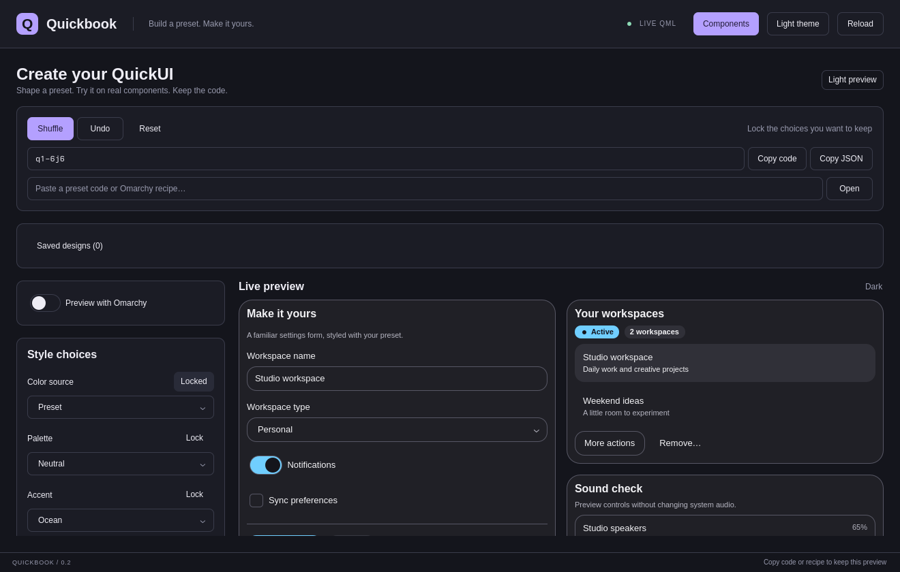

# QuickUI

QuickUI is an editable-source component library for Quickshell. Quickbook is its
native workbench: browse the real components, change inputs and themes, try presets,
and inspect events.



## Install Quickbook and the CLI

Download the source archive from [Releases](https://github.com/brs98/quick-ui/releases/latest),
extract it, and run `python3 scripts/install.py`. This installs `quickui`, `quickbook`,
and a desktop launcher under `~/.local`. Ensure `~/.local/bin` is on PATH.
A Git checkout works with the same command. Installed tools include their own
source snapshot; your shell projects remain separate.

See the [starter guide](docs/getting-started.md) and [installation details](docs/user-install.md).

## Install components into your shell

Requires Python 3.8+ for installation (and Git when using a checkout), and Quickshell with Qt 6.10+ Quick Controls
to run your shell. Tested on Quickshell 0.3.1 / Qt 6.11.2 on Linux/Wayland.

```sh
git clone https://github.com/brs98/quick-ui.git
cd quick-ui
mkdir -p ~/my-shell
./quickui init --cwd ~/my-shell
./quickui add button text-field switch --cwd ~/my-shell
```

This copies QML into `~/my-shell/ui/` and records installed components in
`quickui.json`. The files belong to your project; edit them freely. No Quickbook,
Omarchy, build step, network service, or registry is needed to run the installed UI.
Use the installed `quickui` command or retain a checkout to add components later.

Inside your own window, use ordinary QML imports and share a theme:

```qml
import QtQuick
import "ui" as UI

Item {
    UI.Theme { id: tokens; dark: true; accent: "#72dce8"; radius: 10 }
    UI.Button {
        theme: tokens
        text: "Save changes"
        onClicked: console.log("Save requested")
    }
}
```

The foundation contains **12 components**: `button`, `icon-button`, `text-field`,
`field`, `switch`, `checkbox`, `slider`, `range-slider`, `select`, `card`, `badge`,
and `separator`. Audio adds **five components**: `tooltip`, `level-meter`,
`device-item`, `volume-control`, and `audio-mixer`. Menus add **three components**:
`menu`, `menu-item`, and `menu-separator` — joined by `list-item`, `dialog`, and `alert-dialog` for **23 public components plus Theme and HostTheme**, with an internal `icon-graphic` rendering dependency.
`./quickui list` shows their source files and dependencies.

`add` preserves recorded, customized dependencies and refuses to overwrite edited
explicit targets or unrelated files. `--dry-run` previews installation. The CLI uses a local bundled registry. `quickui diff` reviews upstream changes;
`quickui update` safely updates pristine installed sources. Customized components
remain yours; [merge proposals](docs/updates.md) help you reconcile changes.
See [installer behavior](docs/installer.md), [component APIs](docs/components.md),
and [the library contract](docs/library-contract.md).

## Try a standalone shell

From the cloned repository, install the foundation into a new directory and copy
its runnable example:

```sh
mkdir -p ~/my-quickui-demo
./quickui init --cwd ~/my-quickui-demo
./quickui add button icon-button text-field field switch checkbox slider range-slider select card badge separator --cwd ~/my-quickui-demo
cp templates/starter.qml ~/my-quickui-demo/shell.qml
quickshell -p ~/my-quickui-demo
```

The starter uses mock data and has no desktop service side effects. For a component
browser with editable controls, run `./quickbook` from this checkout instead.

## Build an audio panel

```sh
mkdir -p ~/my-audio-panel
./quickui init --cwd ~/my-audio-panel
./quickui add audio-mixer --cwd ~/my-audio-panel
cp templates/audio.qml ~/my-audio-panel/shell.qml
quickshell -p ~/my-audio-panel
```

The complete mixer includes output/microphone selection, volume and mute controls,
a microphone level meter, application streams, and keyboard navigation. This demo
uses mock data; the reusable components never access your audio services.
See [mixer API](docs/audio-mixer.md), [audio controls](docs/audio-controls.md), and
[Omarchy integration](integrations/omarchy-audio/README.md).
[Audio verification](docs/audio-milestone.md) records the tested integration boundary.

## Build rows and confirmations

```sh
./quickui add list-item alert-dialog text-field --cwd ~/my-shell
cp templates/dialogs.qml ~/my-shell/shell.qml
quickshell -p ~/my-shell
```

ListItem provides native row activation with caller-owned selection and custom
content slots. Dialog accepts your content and standard Qt actions; AlertDialog
starts on Cancel and ignores outside clicks. Actions remain application-owned.
See the [component APIs](docs/components.md) for sizing and focus ownership.

## Build a menu

```sh
mkdir -p ~/my-menu-demo
./quickui init --cwd ~/my-menu-demo
./quickui add menu button --cwd ~/my-menu-demo
cp templates/menu.qml ~/my-menu-demo/shell.qml
quickshell -p ~/my-menu-demo
```

`menu` installs its item and separator components automatically. The example uses
local actions, a checked item, and an appearance submenu. Menu rows can also be
used inside a shell-owned popup, as in the tray adapter. See the
[menu APIs and ownership rules](docs/components.md#menus).

## Integrate with your shell

Components render state and emit interaction signals. Keep PipeWire, compositor,
notification, and other service connections in your own adapters. QuickUI works
without Omarchy; the optional [Omarchy audio adapter](integrations/omarchy-audio/README.md)
is an example of connecting the same components to real desktop services.

## Create a preset natively

Open Quickbook and choose **Create** in the header. Adjust the palette, accent,
font, density, radius, border, selection treatment, and motion while interacting
with real QuickUI controls. Lock settings you want to keep, then shuffle the rest.
Undo returns to the previous configuration.

Copy the versioned preset code to save or share the design. Paste a code into
Create to restore it. You can also copy the preset JSON for a file-based handoff.
The editor does not apply changes to your desktop or shell project.

Use the same code with the source installer:

```sh
./quickui init --preset CODE --cwd ~/my-shell
./quickui preset inspect CODE
./quickui preset apply CODE --cwd ~/my-shell --dry-run
```

A generated `PresetTheme.qml` keeps the preset separate from your owned
`Theme.qml` and components. Applying another preset refuses to overwrite edits
to the generated theme. **Host colors** retains preset typography and
geometry while allowing a shell adapter to provide its colors; standalone
Quickbook shows the fallback palette until a host theme is supplied.

See [presets and source ownership](docs/presets.md) for code stability, JSON
round trips, applying changes, and theme integration. Quickbook restores your design and browsing preferences after closing or reloading.
Save named designs in the native app; codes and recipe JSON remain the portable
sharing format. Event logs and arbitrary component argument text are not saved.

## Preview your Omarchy theme

In **Create**, turn on **Preview with Omarchy**. Quickbook reads your active theme
without changing it and updates the preview as your theme changes. Follow host
colors, font/scale, radius, and spacing independently; uncheck a group to use the
preset choices instead. The radius multiplier stays relative to your host radius,
including square themes. Motion always uses your selected preset preference.

**Copy recipe** includes the fallback preset and all Omarchy follow settings.
Save it as `quickui-omarchy.json`, or paste the JSON back into Quickbook's Open
field. The compact `q1` code continues to describe only the original preset.

```sh
./quickui init --cwd ~/my-shell
./quickui omarchy install --recipe quickui-omarchy.json --cwd ~/my-shell --dry-run
./quickui omarchy install --recipe quickui-omarchy.json --cwd ~/my-shell
```

The optional integration supports both Omarchy shell plugins and standalone
Quickshell projects. See [Omarchy theme integration](integrations/omarchy-theme/README.md)
for wiring the installed source to `UI.OmarchyPreset.hostTokens`, supported versions,
and source ownership. Without an available Omarchy theme, the preview uses its
preset fallback. QuickUI components and ordinary Quickbook previews remain
independent of Omarchy.

## Run the workbench

Tested with **Quickshell 0.3.1** and **Qt 6.11.2 with Qt Quick Controls**.
No Node dependencies or build step. Install Quickshell and its Qt runtime
dependencies using your Linux distribution's packages before launching.

```sh
cd quick-ui
./quickbook
```

Closing the window exits the app. The launcher also works from a Herdr or other multiplexer session that did not inherit the desktop environment: when `DISPLAY`, `WAYLAND_DISPLAY`, and `QT_QPA_PLATFORM` are unset, it selects the single Wayland socket owned by your user in `XDG_RUNTIME_DIR` (or `/run/user/$(id -u)`). If none or several are found, it prints an actionable error. Select a session explicitly with, for example, `WAYLAND_DISPLAY=wayland-1 ./quickbook`.

Explicit display and Qt platform settings are preserved, including `QT_QPA_PLATFORM=offscreen` for automation. Help, version, and Quickshell inspection commands work without a display. You can also run `quickshell -p /path/to/quickbook` directly from a terminal that already has the graphical session's environment.

## What’s included

- Direct previews for all 23 QuickUI components, including the complete audio mixer, a shared-theme playground, and three example compositions.
- Compact layout for narrow tiled windows; use **Components** or `Ctrl+K` to browse.
- Light/dark presets and explicit text, boolean, number, and select controls.
- A Usage tab with install commands and QML snippets for every library entry.
- Dark/light themes, canvas grid, compact/wide widths, and height presets.
- A live event log (latest 100 events) and selectable JSON arguments.
- Reset to the selected preset, automatic QML reload, and a manual reload button.
- IPC for selecting stories, setting controls, and exporting native PNG screenshots.

The explorer itself and its previews use the exact QML files distributed by the installer. Its shared theme extends QuickUI, and its buttons, fields, selects, switches, sliders, tooltips, and separators exercise the library during everyday use. The examples use mock data. Volume and notification interactions never change your desktop services.

| Shortcut | Action |
| --- | --- |
| `Ctrl+K` | Focus component search |
| `Ctrl+R` | Reload the QML configuration |
| `Ctrl+0` | Reset the active story or Create preset |

Selecting a different component clears its event log and selects its first preset. Reset restores arguments and story-local state. Reloading restores saved selection, theme, and canvas preferences; story arguments and event logs start fresh.

## Add your component

Create a wrapper in `stories/`. A story is a normal Qt Quick `Item` with this small contract:

```qml
// stories/SaveButtonStory.qml
import QtQuick
import "../registry/quickui" as UI

Item {
    id: root
    property var args: ({})
    property bool dark: true
    signal eventRaised(string name, var payload)
    implicitWidth: button.implicitWidth
    implicitHeight: button.implicitHeight

    UI.Button {
        id: button
        anchors.fill: parent
        text: root.args.label ?? "Save"
        theme: UI.Theme { dark: root.dark }
        enabled: root.args.disabled !== true
        onClicked: root.eventRaised("clicked", {label: text})
    }
}
```

Append its metadata to `entries` in `stories/Catalog.qml`:

```qml
{
    id: "save-button", // Unique and stable; also used by IPC.
    group: "My library",
    title: "Save button",
    description: "The save action used in settings.",
    source: Qt.resolvedUrl("SaveButtonStory.qml"),
    controls: [
        {key: "label", label: "Label", type: "text"},
        {key: "disabled", label: "Disabled", type: "boolean"}
    ],
    presets: [
        {name: "Ready", args: {label: "Save", disabled: false}},
        {name: "Disabled", args: {label: "Save", disabled: true}}
    ]
}
```

Save and the explorer reloads. Import your real components in the wrapper; they do not need to depend on Quickbook.

Control metadata:

| Type | Value | Additional metadata |
| --- | --- | --- |
| `text` | string | — |
| `boolean` | boolean | — |
| `number` | finite number | `min`, `max`, `step` (slider increment) |
| `select` | string | `options: ["one", "two"]` |

Give each story at least one preset and supply the complete initial argument set in every preset. The explorer validates edits, clamps numeric bounds, and replaces the argument object when a control changes. Presets should contain plain JSON values. For interactive state owned by a wrapper, reset that state in `onArgsChanged`; see `VolumeStory.qml`.

Set sensible `implicitWidth` and `implicitHeight` values. The explorer fits the story within the chosen canvas, shrinking it when necessary; use ordinary responsive QML layouts inside your component. Canvas sizes are capped to available space and the actual dimensions appear underneath.

For components that currently access PipeWire, notification services, or compositor state directly, move visual inputs into properties and forward actions through signals. Supply fixtures in your story wrapper and real service values in your desktop shell.

## Automation and screenshots

With Quickbook running, execute from its project directory:

```sh
quickshell ipc -p "$PWD" call quickbook status
quickshell ipc -p "$PWD" call quickbook select volume-card
quickshell ipc -p "$PWD" call quickbook preset 2
quickshell ipc -p "$PWD" call quickbook control volume '42'
quickshell ipc -p "$PWD" call quickbook control deviceName '"Headphones"'
quickshell ipc -p "$PWD" call quickbook theme false
quickshell ipc -p "$PWD" call quickbook reset
quickshell ipc -p "$PWD" call quickbook capture "$PWD/artifacts/preview.png"
```

`control` takes a JSON value. Invalid IDs, indices, properties, or values return `false`. `capture` returns whether the asynchronous capture started; completion or a save error is logged to the launching terminal. The destination directory must exist. Add `--any-display` before `call` when addressing an offscreen instance.

## Validate

Qt 6 development tools and Python 3 are needed for the checks. On Arch, Qt 5 tools can share the same executable names; the test runner prefers `/usr/lib/qt6/bin`.

```sh
./scripts/test
python3 scripts/smoke.py
python3 scripts/create_smoke.py
python3 scripts/omarchy_smoke.py
python3 scripts/installed_smoke.py
python3 scripts/audio_smoke.py
python3 scripts/menu_smoke.py
python3 scripts/dialog_smoke.py
python3 scripts/accessibility_smoke.py
python3 scripts/persistence_smoke.py
```

The first command runs launcher and installer regressions, QML lint, and Qt Quick interaction tests, including all primitive presets and both themes. The launcher tests use temporary sockets and a stub executable to verify display discovery and command forwarding without starting Qt. The smoke check starts a separate Quickshell process using the software offscreen renderer, exercises IPC and hot reload in a temporary config, and writes `artifacts/quickbook-dark.png` and `artifacts/quickbook-light.png`. It does not need an active desktop and does not affect any running Quickbook instance. The installed-source smoke test independently copies all twelve foundation components into a fresh project, edits its Theme, launches the standalone starter, and captures `artifacts/quickui-starter.png`.

The Create smoke renders desktop dark/light and narrow layouts, exercises locked shuffle and undo, and checks a native-editor-to-CLI round trip with owned-source preservation. It uses a disposable configuration and does not require an IPC socket.

The audio smoke test installs the mixer and its dependency closure in an isolated
project, exercises mock actions and both themes through native Quickshell, and
exports audio demo screenshots. Qt tests cover keyboard navigation, focus,
controlled requests, bounds, dynamic device lists, and adapter actions.

The menu smoke installs copied menu sources into a fresh project, preserves an
edited Theme, and checks native activation, check state, dismissal, and dark/light
popup captures.

The accessibility smoke builds a small native probe (C++ compiler, `pkg-config`,
and Qt 6 development headers required), then checks the actual QAccessible tree:
bounded meter values, each range handle's accepted bounds, selected devices, and
the focused panel cursor, and native menu item check/disabled states. The Quickbook smoke also captures the new composition
stories, including icons, Field feedback, RangeSlider, and RTL audio controls.

## Project map

- `registry/quickui/`: canonical distributable QML source.
- `registry.json` and `quickui`: dependency registry and source installer.
- `templates/starter.qml`: standalone consumer using all twelve foundation components.
- `templates/audio.qml`: standalone mock audio panel.
- `templates/dialogs.qml`: editable workspace dialog and safe confirmation with local state.
- `templates/menu.qml`: standalone menu with local actions, checks, and a submenu.
- `integrations/omarchy-audio/`: real audio service adapter and installation notes.
- `shell.qml`: native workbench window and IPC bridge.
- `app/Explorer.qml`: browser, canvas, controls, and event inspector.
- `app/ExplorerState.qml`: selection, presets, input validation, and event history.
- `app/ControlEditor.qml`: editors generated from control metadata.
- `stories/Catalog.qml` and `stories/primitives/`: explicit story registration and direct primitive previews.
- `stories/*Story.qml`: adapters between real components and story inputs/events.
- `examples/`: independent reusable QML components with no desktop service dependencies.

This first version previews visual Qt Quick items. Actual `PanelWindow`/`PopupWindow` stories need a separate window harness and are not embedded in the canvas. Story discovery and control metadata are explicit; automatic introspection, screenshot diffing, and web publishing are not included.

## Current scope

This is an early source-library release. Installation uses the registry bundled
with your checkout; use a Git tag or commit to choose a consistent source revision.
Remote registries and a broader Qt/Quickshell/compositor compatibility matrix
remain future work. Releases include installable source archives and checksums;
GitHub Actions validates native behavior before publishing tags.
Full screen-reader verification and additional reusable shell blocks also remain
future work.

## License

QuickUI and Quickbook are [MIT licensed](LICENSE). Installed QuickUI source files
include the license notice so it travels with copied components. Keep these
notices when redistributing the source or substantial portions of it.
The optional Omarchy integration retains its upstream MIT attribution; see
[third-party notices](THIRD_PARTY_NOTICES.md).
