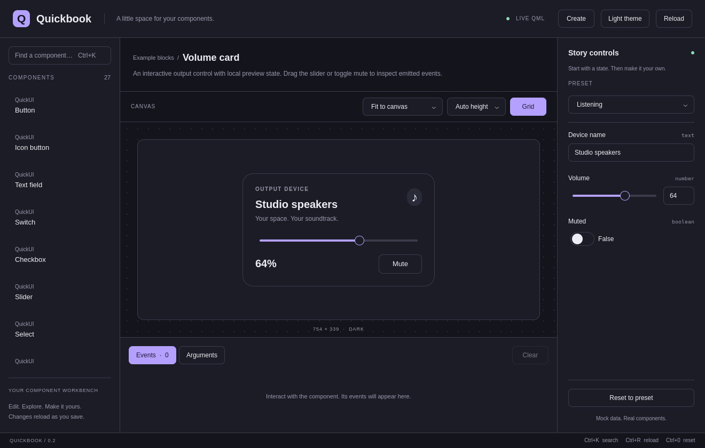

# Your first QuickUI shell

QuickUI copies editable QML into your project. Quickbook is the native application
for browsing those controls and creating themes. Your shell runs independently of
Quickbook and does not require Omarchy.

## Install the tools

Install Python 3.8+ and Quickshell with Qt 6.10+ Quick Controls using your Linux
distribution's packages. Download the source archive and `SHA256SUMS` from
[the latest release](https://github.com/brs98/quick-ui/releases/latest), then verify
and extract it:

```sh
sha256sum -c SHA256SUMS
tar -xzf quick-ui-0.2.0.tar.gz
cd quick-ui-0.2.0
python3 scripts/install.py --dry-run
python3 scripts/install.py
```

Ensure `~/.local/bin` is on your PATH. Open **Quickbook** from your desktop launcher,
or run `quickbook`. The installation contains its own source snapshot, so you can
remove the extracted release folder. See [installation](user-install.md) for custom
prefixes, updating the tools, and uninstalling them.



## Make a shell

```sh
mkdir -p ~/my-shell
quickui init --cwd ~/my-shell
quickui add button text-field switch --cwd ~/my-shell
```

Create `~/my-shell/shell.qml`:

```qml
import QtQuick
import QtQuick.Layouts
import Quickshell
import "ui" as UI

ShellRoot {
    FloatingWindow {
        implicitWidth: 420
        implicitHeight: 260
        visible: true
        color: tokens.background
        UI.Theme { id: tokens; dark: true; accent: "#72dce8" }
        ColumnLayout {
            anchors.centerIn: parent
            spacing: 12
            UI.TextField { theme: tokens; placeholderText: "Your name" }
            UI.Switch { theme: tokens; text: "Enable notifications" }
            UI.Button { theme: tokens; text: "Save"; onClicked: console.log("Saved") }
        }
    }
}
```

```sh
quickshell -p ~/my-shell
```

The controls emit interaction signals; your application supplies service behavior.
Edit the copied files in `~/my-shell/ui/` whenever you need to customize them.

## Design a theme

Open **Create** in Quickbook. Adjust the theme variables, lock choices you like,
and shuffle the rest. Save a named design locally or copy its `q1` preset code to
share it. Quickbook restores your last session when reopened.

```sh
quickui preset apply CODE --cwd ~/my-shell --dry-run
quickui preset apply CODE --cwd ~/my-shell
```

Replace `UI.Theme` in the example with `UI.PresetTheme { id: tokens }` to use the
generated preset. For Omarchy, enable **Preview with Omarchy**, select which
settings to follow, and copy a recipe. See [the optional theme adapter](../integrations/omarchy-theme/README.md)
for installing the host connection into your shell.

## Keep your project current

Install a newer QuickUI release, then review the changes to your copied components:

```sh
quickui diff --cwd ~/my-shell
quickui update --cwd ~/my-shell --dry-run
quickui update --cwd ~/my-shell
```

Pristine files can update automatically. Edited components stay untouched; use
[review proposals](updates.md) to reconcile local and upstream changes. Keep your
project under version control so you can review and revert source changes.
