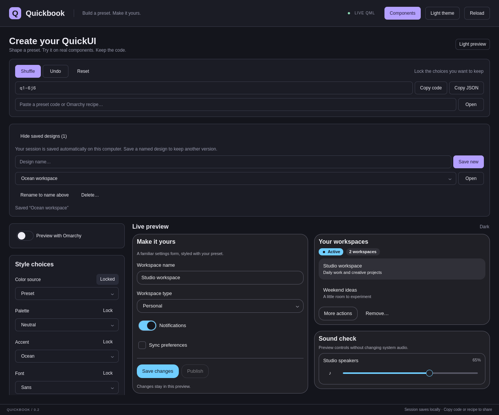

# Sessions and saved designs

Quickbook automatically restores your last session. In **Create**, expand
**Saved designs** to save a named version, open it, rename it using the name
field, or delete it after confirmation. Saving an existing name is rejected;
choose a different name to keep another version. Names are compared without
case, limited to 80 characters, and the library holds up to 100 designs.

Each design includes its immutable `q1` preset code, shuffle locks, preview
light/dark mode, whether Omarchy preview is enabled, the four host-follow
settings, and the relative radius multiplier. Omarchy designs resume following
the live host; they do not capture a stale host palette. Portable designs reopen
with Omarchy preview disabled. Copy code, Copy JSON, and Copy recipe remain the
portable export paths for sharing outside this computer.

The session also restores Create/Components mode, selected component and its
built-in variant, explorer light/dark mode, grid, and canvas dimensions. Event
logs, search text, arbitrary component control values, and gallery form inputs
are deliberately not saved. Undo history starts fresh after reopening a design.

## Storage

State lives in `$XDG_STATE_HOME/quickbook/state.json`, normally
`~/.local/state/quickbook/state.json`. It contains only the fields described
above and named designs. `QUICKBOOK_STATE_DIR=/some/directory` overrides the
complete directory. `QUICKBOOK_NO_PERSIST=1` disables reads and writes; named
design actions then last only for the current process. Tests use a temporary
directory or disable persistence and never mutate the real user state.

The optional Quickshell bridge calls a local Python helper; plain Qt previews
perform no filesystem access. Writes debounce for 400 milliseconds. Normal
window closing and Quickbook's **Ctrl+R** reload wait for pending changes to
flush. Forced termination, process crashes, and external source-file hot reloads
can lose changes still inside that debounce interval.

Files are schema-validated, bounded to 256 KiB, and replaced atomically with
owner-only permissions. A lock and content revision prevent a second Quickbook
process from silently overwriting a state file changed since it was loaded.
For a conflict, close and reopen Quickbook to load the latest saved state.

Malformed or unsupported files stay intact, automatic saving stops, and a
visible error offers **Back up and reset saved state**. That action renames the
original to `state.backup-<timestamp>.json` in the same directory, clears the
saved-design library, and begins saving the current preview as a fresh session.
You can inspect or recover the original backup manually. Other read/write
failures also appear in the banner rather than silently discarding saved data.
